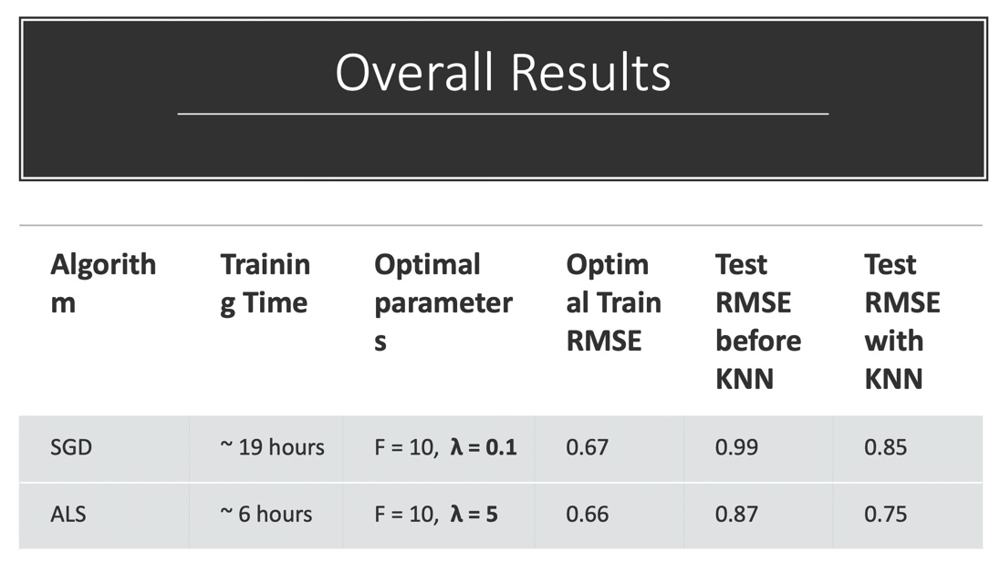

In this project, you are going to explore matrix factorization methods for recommender system. The goal is to match consumers with most appropriate products. Matrix factorization methods characterize both items and users by vectors of factors inferred from item rating patterns. High correspondence between item and user factors leads to a recommendation. Matrix factorization generally has 3 parts:

- factorization algorithm

- regularization

- postpocessing


### Step 1 Load Data and Train-test Split
```{r}
library(dplyr)
library(tidyr)
library(ggplot2)
data <- read.csv("../data/ml-latest-small/ratings.csv")
set.seed(0)


## Binning the timestamp and add a column representing the bin that the time belongs to
## Here we choose the number of bins to be 23 (One bin per year)
## That is to say, we create a b(i,Bin(t))  of size number of rating x 23

#convert timestamps to date format 
            convt_dates =  as.Date( as.POSIXct(  data$timestamp , origin = "1970-01-01", tz = "UTC")  )   
            date_range = max(convt_dates) - min (convt_dates)  ## 8214 days/ 1173 weeeks 
            # the  dates breaks into 30 bins with 1 year in each bin 
            cut_dates = cut( convt_dates, breaks = "1 year", labels = paste(1:23))  
            # adding the bin number to the train dataset 
            data  = data %>% mutate(group =cut_dates)
            
            
test_idx <- sample(1:nrow(data), round(nrow(data)/5, 0))
train_idx <- setdiff(1:nrow(data), test_idx)
data_train <- data[train_idx,]
data_test <- data[test_idx,]
```


### Step 2: SDG Algorithm with time dynamic Regularization

#### Step 2.1 Algorithm and Regularization
Here I perform stochastic gradien descent to do matrix factorization.

- For algorithms, the referenced paper are:

A1. [Stochastic Gradient Descent](./paper/P1 Recommender-Systems.pdf) Section: Learning Algorithms-Stochastic Gradient Descent

A2. [Gradient Descent with Probabilistic Assumptions](./paper/P3 probabilistic-matrix-factorization.pdf) Section 2

A3. [Alternating Least Squares](./paper/P4 Large-scale Parallel Collaborative Filtering for the Netflix Prize.pdf) Section 3.1

- For regularizations, the referenced paper are:

R1. [Penalty of Magnitudes](./paper/P1 Recommender-Systems.pdf) Section: a Basic Matrix Factorization Model

R2. [Bias and Intercepts](./paper/P1 Recommender-Systems.pdf) Section: Adding Biases

R3. [Temporal Dynamics](./paper/P5 Collaborative Filtering with Temporal Dynamics.pdf) Section 4 linear model


```{r}
U <- length(unique(data$userId))
I <- length(unique(data$movieId))
source("../lib/Matrix_Factorization.R")
```


#### Step 2.2 Parameter Tuning
Here you should tune parameters, such as the dimension of factor and the penalty parameter $\lambda$ by cross-validation.
```{r}
source("../lib/cross_validation.R")
f_list <- seq(10, 20, 10)
l_list <- seq(-2, -1, 1)
f_l <- expand.grid(f_list, l_list)
```

```{r, eval=FALSE}
result_summary <- array(NA, dim = c(nrow(f_l), 4, 4)) 
run_time <- system.time(for(i in 1:nrow(f_l)){
    par <- paste("f = ", f_l[i,1], ", lambda = ", 10^f_l[i,2])
    cat(par, "\n")
    current_result <- cv.function(data, K = 5, f = f_l[i,1], lambda = 10^f_l[i,2])
    result_summary[,,i] <- matrix(unlist(current_result), ncol = 4, byrow = T) 
    print(result_summary)
  
})

save(result_summary, file = "../output/rmse.Rdata")
```

save the result in the cv_rmse.Rdata
```{r}
save(result_summary, file = "../output/cv_rmse.Rdata")
```


```{r}
load("../output/cv_rmse.Rdata")
rmse <- data.frame(rbind(t(result_summary[1,,]), t(result_summary[2,,])), train_test = rep(c("Train", "Test"), each = 4), par = rep(paste("f = ", f_l[,1], ", lambda = ", 10^f_l[,2]), times = 2)) %>% gather("epoch", "RMSE", -train_test, -par)
rmse$epoch <- as.numeric(gsub("X", "", rmse$epoch))
rmse %>% ggplot(aes(x = epoch, y = RMSE, col = train_test)) + geom_point() + facet_grid(~par)
```

#### Step 2.3 Postprocessing
After matrix factorization, postporcessing will be performed to improve accuracy.
The referenced papers are:

After Cross-validation, we train the model with the best hyper-parameter pair: f = 10, lambda = 0.1
```{r, eval= FALSE}
result <- gradesc(f = 10, lambda = 0.1,lrate = 0.01, max.iter = 40, stopping.deriv = 0.01,
                   data = data, train = data_train, test = data_test)

save(result, file = "../output/mat_fac.RData")
```

After the training, we have the parameters: p, q, b_i, b_t, b_i,Bin(t), we can construct the prediction matrix for the ratings. In the matrix, each (u,i) has a 23-length array coresponding to the 23 time bins we have previously. In this case, we have the ratings for every user and every movie with respect to time. It is stored in the dynamic_est_rating matrix. 
```{r}
mu <- mean(data[,3])
est_rating <- t(result$q) %*% result$p
      
est_rating <- est_rating  + mu + matrix(t(result$b_item) , length(t(result$b_item)) , dim(est_rating)[2] ) +matrix(result$b_user , dim(est_rating)[1],length(result$b_user),byrow=TRUE)
      
      
## Inclusing the time dynamicof items:
      
dynamic_est_rating  = matrix(list(),dim(est_rating)[1] , dim(est_rating)[2])
  for (i in 1:dim(est_rating)[1])
    for (u in 1:dim(est_rating)[2]){
      dynamic_est_rating[i,u][[1]] = est_rating[i,u] + result$b_time[,i]
        }
      
      
rownames(dynamic_est_rating) <- levels(as.factor(data$movieId))
colnames(dynamic_est_rating) <- as.character(1:U)

```

And the following csv files (rating_merge_train.csv, rating_merge_test.csv) are the results of the KNN indicated as thr knn column in the below dataframe

```{r,warning=FASLE}
knn_lm <- read.csv('../output/rating_merge_train.csv')
knn_lm$b_item <- as.numeric(as.character(knn_lm$b_item))
knn_lm <- knn_lm[complete.cases(knn_lm), ]

knn_lm %>% head()
```

We run the linear regression on the rating~knn+pq+b_item+b_user+b_time and get the coeffcients for the test set
```{r,warning=FASLE}
ml <- lm(rating~knn+pq+b_item+b_user+b_time,data=knn_lm)
summary(ml)
```

We predict the rating for the test set using the coeffecients from the training set and the knn pq b_item b_user b_time values from the below test dataframe and compare the predicted Y_hat with the rating in the test set.
```{r}
knn_lm_test <- read.csv('../output/rating_merge_test.csv')
knn_lm_test$b_item <- as.numeric(as.character(knn_lm_test$b_item))
knn_lm_test <- knn_lm_test[complete.cases(knn_lm_test), ]
knn_lm_test %>% head()
```

The Adjusted RMSE is then calculated using the predicted rating and the rating.
```{r}
R <- predict(ml,newdata=knn_lm_test[,c(7,8,9,10,11)])

knn_sqrt <- (knn_lm_test$rating-R)^2
knn_rmse <- sqrt(sum(knn_sqrt,na.rm=TRUE)/length(R))

print(paste0('The RMSE after the post-processing for ther test set is :',knn_rmse))
```


### Step 3: ALS Algorithm with time dynamic Regularization

The ALS Algorithm is done in python by Nicole Mbithe. 
(refer to notebook doc/ALS implementation.ipynb)   
And the code also returns p, q, b_i, b_t, b_i,Bin(t) for the ALS Algorithm


```{r}
#library("devtools")
#install.packages("devtools", repos = "http://cran.us.r-project.org")
devtools::install_github("rstudio/reticulate")
library(reticulate)
py_install("pandas")
py_install("numpy")
py_install("matplotlib")
py_install("seaborn")
```

#### Step 3.1: Algorithm and Regularization functions

```{python}
import pandas as pd
import numpy as np
import matplotlib.pyplot as plt
#read in the data
data = pd.read_csv("../data/ml-latest-small/ratings.csv")

#get the necessary dimensions
n_users = data['userId'].nunique()
n_movies = data['movieId'].nunique()
#split the data into different bins for the temporal function
def get_bin(num):
    #subtracts 25 because they started collecting the data 25 years after january 1970
    return int((num)/(60*60*24*365)) - 25
data["bin"] = data["timestamp"].apply(get_bin)
data_groups = data.groupby("bin")

```

```{python}
#create R matrix
n_users = data.userId.unique().shape[0]
n_items = data.movieId.unique().shape[0]
movieIds = sorted(data.movieId.unique())

R_init = np.zeros((n_users, n_items))
bin_match = np.zeros((n_users, n_items)) 

#stored the bin number for each user movie pair
for row in data.itertuples():
    #print(row)
    R_init[row[1]-1, movieIds.index(row[2])] = row[3]
    bin_match[row[1]-1, movieIds.index(row[2])] = int(row[5]-1)
```


```{python}
def get_error(R, R_hat):
    #only for the that had ratings in the training matrix
    mask = (R>0)
    R_hat[mask] = 0 #set the values we don't need predictions for to 0 
    return np.sqrt(((R - R_hat)**2).mean()) #return the RMSE

def predict(U, M, mu,b_i, b_u, bin_match ,B_i_bint):
    R = np.zeros((n_users, n_movies))
    #do we need to iterate over time as well
    for u in range(n_users):#iterate over users
        for i in range(n_movies):#iterate over movies
            bin_num = int(bin_match[u,i]) #get the bin number for user u and movie i
            R[u,i] = mu+b_u[u]+b_i[i]+B_i_bint[bin_num,i]+np.dot(U[u,:],M[i,:].T)
    return R
```


```{python}
#alternate implementation from online resource
np.random.seed(1)
def train(Mat, bin_match, f, lambda_, n_iter):
    R = Mat[:]
    # Step 1 Initialize matrix M by assigning the average rating for that movie as the first row, and small random numbers for the remaining entries.
    M = np.random.rand(n_movies,f)
    M[:,0] = R.sum(0)/(R!=0).sum(0).astype(float)
    
    U = np.random.rand(n_users,f)#initialize U matrix
    
    mu = R.sum()/(R!=0).sum().astype(float)#average rating
    b_i = np.random.rand(n_movies)#initialize b_i = len(movies)
    b_u = np.random.rand(n_users) #initialize b_u = len(users)
    B_i_bint = np.random.rand(data['bin'].nunique(),n_movies)
    
    #function to minimize: sum(r_ui - ^r_ui) + lambda(b_i^2 + b_u^2+ |q|^2 + |p|^2 )
    for epoch in range(n_iter):
        #Step 2 Fix M, Solve U by minimizing the objective function
        for i in range(n_users):
            I_i = np.nonzero(R[i,:])[0] #set of movies that user i rated
            n_ui = len(I_i) #number of ratings user i has given 
            E = np.identity(f+1)
            idx = np.vstack([bin_match[i,I_i], I_i]).astype(int)
            r_u = R[i,I_i] - b_i[I_i] - mu #- B_i_bint[tuple(idx)]
            m = np.ones((n_movies,1))
            M_p = np.concatenate((m,M),1)
            M_Ii = M_p[I_i,:]
            u_prime = np.linalg.solve((np.dot(M_Ii.T,M_Ii)+(lambda_*E)), np.dot(r_u,M_Ii))
            b_u[i] = u_prime[0]
            U[i,:] = u_prime[1:]
           
        #Step 3 Fix U, solve M by minimizing the objective function similarly; 
        for j in range(n_movies):
            I_j = np.nonzero(R[:,j])[0] #set of users that rated movie j
            n_mj = len(I_j) #number of users that rated movie j
            matches = bin_match[I_j,j].astype(int) #the t for each user with movie j
            r_j = R[I_j,j] - b_u[I_j] - mu #- B_i_bint[matches,j]
            
            u = np.ones((n_users,1))
            U_p = np.concatenate((u,U),1)
            U_Ij = U_p[I_j,:]
            m_prime = np.linalg.solve((np.dot(U_Ij.T,U_Ij)+(lambda_*E)), np.dot(r_j,U_Ij))
            b_i[j] = m_prime[0]
            M[j,:] = m_prime[1:]
            
            #if the movie is not represented in the training data
            if(np.linalg.norm(m_prime)==0):
                b_i[j] = np.random.rand(1)
                M[j,:] = np.random.rand(f)
            
        for t in range(len(B_i_bint)):
            mask = bin_match == t
            for i in range(n_movies):
                r_it = R[:,i][mask[:,i]]- mu - b_u[mask[:,i]] - b_i[i]- np.dot(U[mask[:,i]], M[i,:])
                B_i_bint[t,i] = np.sum(r_it)/(len(r_it)+lambda_)                                                   
    
        R_hat = predict(U, M, mu,b_i, b_u, bin_match ,B_i_bint)
        error = get_error(R, R_hat)
        print("iteration: ", epoch, "; error: ", error)
    
    return U, M,mu, b_u, b_i, B_i_bint
```


```{python}
def get_mat(df):
    R = np.zeros((n_users, n_items))
    bin_match = np.zeros((n_users, n_items)) 
    for row in df.itertuples():
        R[row[1]-1, movieIds.index(row[2])] = row[3]
        bin_match[row[1]-1, movieIds.index(row[2])] = int(row[5]-1)
    return R, bin_match

def get_fold(data,K):
    fold_num = []
    i =0
    while i<len(data):
        for j in range(5):
            if(i<len(data)):
                fold_num.append(j)
            i+=1
    return fold_num

def cv(X, K, f, lambda_):
    df = X
    df['fold'] = get_fold(X,K)
    test_errors = []
    train_errors = []
    for k in range(K):
        print("fold: ", k)
        k_test = df[df.fold == k]
        k_train = df[df.fold != k]
        k_train_mat, k_train_bins = get_mat(k_train)
        k_test_mat, k_test_bins = get_mat(k_test)
        
        #get the parameters
        k_train_U, k_train_M, k_train_mu, k_train_b_u, k_train_b_i, k_train_B_i_bint = train(k_train_mat, k_train_bins, f, lambda_, 10)
        k_train_hat = predict(k_train_U, k_train_M, k_train_mu,k_train_b_i, k_train_b_u, k_train_bins ,k_train_B_i_bint)
        
        #get training error
        train_error = get_error(k_train_mat, k_train_hat)
        train_errors.append(train_error)
        
        #get the prediction
        k_test_hat = predict(k_train_U, k_train_M, k_train_mu,k_train_b_i, k_train_b_u, k_test_bins ,k_train_B_i_bint)
        error = get_error(k_test_mat, k_test_hat)
        test_errors.append(error)
        
    return train_errors, test_errors
```

#### Step 3.2 Cross validation to select the best hyperparameter pair

```{python,eval=FALSE}
#run the cross validation and test
f_s = [2,4,10]
lambda_s= [0.1,1,5] 

#train for 10 iterarions each time
trains = []
tests = []
for f in f_s:
    train_avs = []
    test_avs = []
    for lambda_ in lambda_s:
        tr_errors, tst_errors = cv(data, 5, f, lambda_ )
        train_avs.append(np.mean(tr_errors))
        test_avs.append(np.mean(tsts_errors))
    trains.append(train_avs)
    tests.append(test_avs)
```

```{python}
#using the final train data 80%
df = pd.read_csv("../output/data_train.csv")[["userId","movieId","rating","timestamp","bin_num"]]

R, bins = get_mat(df)
U, M, mu, b_u, b_i, B_i_bint = train(R, bins,10, 1, 20)
```


The Postprocessing part is done by Sixuan Li in Python.
(refer to notebook file doc/sl_knn_sgd.ipynb)
Using the output from the previous step and using q to calculate knn And output a csv  file to run linear regression


### Step 3.3: ALS Postprocessing:

ALS Postprocessing:
```{r}
knn_lm_ALS <- read.csv('../output/rating_merge_train_ALS.csv')
knn_lm_ALS$b_item <- as.numeric(as.character(knn_lm_ALS$b_item))
knn_lm_ALS <- knn_lm_ALS[complete.cases(knn_lm_ALS), ]

knn_lm_ALS %>% head()
```

```{r}
ml_ALS <- lm(rating~knn+pq+b_item+b_user+b_time,data=knn_lm_ALS)
summary(ml_ALS)
```

```{r}
knn_lm_test_ALS <- read.csv('../output/rating_merge_test_ALS.csv')
knn_lm_test_ALS$b_item <- as.numeric(as.character(knn_lm_test_ALS$b_item))
knn_lm_test_ALS <- knn_lm_test_ALS[complete.cases(knn_lm_test_ALS), ]
knn_lm_test_ALS %>% head()
```

```{r}
R_ALS <- predict(ml_ALS,newdata=knn_lm_test_ALS[,c(7,8,9,10,11)])

knn_sqrt_ALS <- (knn_lm_test_ALS$rating-R_ALS)^2
knn_rmse_ALS <- sqrt(sum(knn_sqrt_ALS,na.rm=TRUE)/length(R_ALS))

print(paste0('The RMSE after the post-processing for ther test set is :',knn_rmse_ALS))
```

### Step 4 Evaluation

We compare the final model of our reconmmender system with SGD and ALS with time dynamic regulization and KNN post processing. 

The detailed summary is presented in the below table:

 
