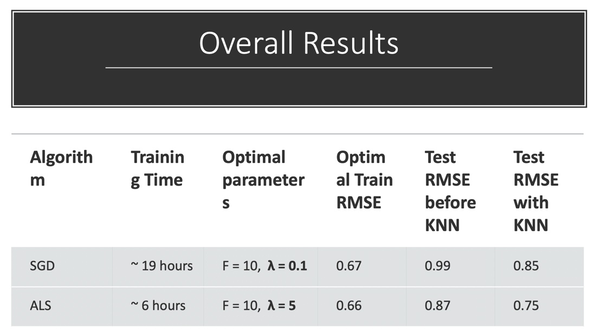

In this project, you are going to explore matrix factorization methods for recommender system. The goal is to match consumers with most appropriate products. Matrix factorization methods characterize both items and users by vectors of factors inferred from item rating patterns. High correspondence between item and user factors leads to a recommendation. Matrix factorization generally has 3 parts:

- factorization algorithm

- regularization

- postpocessing


### Step 1 Load Data and Train-test Split
```{r}
library(dplyr)
library(tidyr)
library(ggplot2)
data <- read.csv("../data/ml-latest-small/ratings.csv")
set.seed(0)


## Binning the timestamp and add a column representing the bin that the time belongs to
## Here we choose the number of bins to be 23 (One bin per year)
## That is to say, we create a b(i,Bin(t))  of size number of rating x 23

#convert timestamps to date format 
            convt_dates =  as.Date( as.POSIXct(  data$timestamp , origin = "1970-01-01", tz = "UTC")  )   
            date_range = max(convt_dates) - min (convt_dates)  ## 8214 days/ 1173 weeeks 
            # the  dates breaks into 30 bins with 1 year in each bin 
            cut_dates = cut( convt_dates, breaks = "1 year", labels = paste(1:23))  
            # adding the bin number to the train dataset 
            data  = data %>% mutate(group =cut_dates)
            
            
test_idx <- sample(1:nrow(data), round(nrow(data)/5, 0))
train_idx <- setdiff(1:nrow(data), test_idx)
data_train <- data[train_idx,]
data_test <- data[test_idx,]
```


### SDG Algorithm with time dynamic Regularization

#### Step 2.1 Algorithm and Regularization
Here I perform stochastic gradien descent to do matrix factorization.

- For algorithms, the referenced paper are:

A1. [Stochastic Gradient Descent](./paper/P1 Recommender-Systems.pdf) Section: Learning Algorithms-Stochastic Gradient Descent

A2. [Gradient Descent with Probabilistic Assumptions](./paper/P3 probabilistic-matrix-factorization.pdf) Section 2

A3. [Alternating Least Squares](./paper/P4 Large-scale Parallel Collaborative Filtering for the Netflix Prize.pdf) Section 3.1

- For regularizations, the referenced paper are:

R1. [Penalty of Magnitudes](./paper/P1 Recommender-Systems.pdf) Section: a Basic Matrix Factorization Model

R2. [Bias and Intercepts](./paper/P1 Recommender-Systems.pdf) Section: Adding Biases

R3. [Temporal Dynamics](./paper/P5 Collaborative Filtering with Temporal Dynamics.pdf) Section 4 linear model


```{r}
U <- length(unique(data$userId))
I <- length(unique(data$movieId))
source("../lib/Matrix_Factorization.R")
```


#### Step 2.2 Parameter Tuning
Here you should tune parameters, such as the dimension of factor and the penalty parameter $\lambda$ by cross-validation.
```{r}
source("../lib/cross_validation.R")
f_list <- seq(10, 20, 10)
l_list <- seq(-2, -1, 1)
f_l <- expand.grid(f_list, l_list)
```

```{r, eval=FALSE}
result_summary <- array(NA, dim = c(nrow(f_l), 4, 4)) 
run_time <- system.time(for(i in 1:nrow(f_l)){
    par <- paste("f = ", f_l[i,1], ", lambda = ", 10^f_l[i,2])
    cat(par, "\n")
    current_result <- cv.function(data, K = 5, f = f_l[i,1], lambda = 10^f_l[i,2])
    result_summary[,,i] <- matrix(unlist(current_result), ncol = 4, byrow = T) 
    print(result_summary)
  
})

save(result_summary, file = "../output/cv_rmse.Rdata")
```

save the result in the cv_rmse.Rdata

```{r}
load("../output/cv_rmse.Rdata")
rmse <- data.frame(rbind(t(result_summary[1,,]), t(result_summary[2,,])), train_test = rep(c("Train", "Test"), each = 4), par = rep(paste("f = ", f_l[,1], ", lambda = ", 10^f_l[,2]), times = 2)) %>% gather("epoch", "RMSE", -train_test, -par)
rmse$epoch <- as.numeric(gsub("X", "", rmse$epoch))
rmse %>% ggplot(aes(x = epoch, y = RMSE, col = train_test)) + geom_point() + facet_grid(~par)
```

### Step 3 Postprocessing
After matrix factorization, postporcessing will be performed to improve accuracy.
The referenced papers are:

After Cross-validation, we train the model with the best hyper-parameter pair: f = 10, lambda = 0.1
```{r, eval= FALSE}
result <- gradesc(f = 10, lambda = 0.1,lrate = 0.01, max.iter = 40, stopping.deriv = 0.01,
                   data = data, train = data_train, test = data_test)

save(result, file = "../output/mat_fac.RData")
```

After the training, we have the parameters: p, q, b_i, b_t, b_i,Bin(t), we can construct the prediction matrix for the ratings. In the matrix, each (u,i) has a 23-length array coresponding to the 23 time bins we have previously. In this case, we have the ratings for every user and every movie with respect to time. It is stored in the dynamic_est_rating matrix. 
```{r}
load("../output/mat_fac.RData")

mu <- mean(data[,3])
est_rating <- t(result$q) %*% result$p
      
est_rating <- est_rating  + mu + matrix(t(result$b_item) , length(t(result$b_item)) , dim(est_rating)[2] ) +matrix(result$b_user , dim(est_rating)[1],length(result$b_user),byrow=TRUE)
      
      
## Inclusing the time dynamicof items:
      
dynamic_est_rating  = matrix(list(),dim(est_rating)[1] , dim(est_rating)[2])
  for (i in 1:dim(est_rating)[1])
    for (u in 1:dim(est_rating)[2]){
      dynamic_est_rating[i,u][[1]] = est_rating[i,u] + result$b_time[,i]
        }
      
      
rownames(dynamic_est_rating) <- levels(as.factor(data$movieId))
colnames(dynamic_est_rating) <- as.character(1:U)

```

And the following csv files (rating_merge_train.csv, rating_merge_test.csv) are the results of the KNN indicated as thr knn column in the below dataframe

```{r, message=FALSE}
knn_lm <- read.csv('../output/rating_merge_train.csv')
knn_lm$b_item <- as.numeric(as.character(knn_lm$b_item))
knn_lm <- knn_lm[complete.cases(knn_lm), ]
```

We run the linear regression on the rating~knn+pq+b_item+b_user+b_time and get the coeffcients for the test set
```{r}
ml <- lm(rating~knn+pq+b_item+b_user+b_time,data=knn_lm)
summary(ml)
```

We predict the rating for the test set using the coeffecients from the training set and the knn pq b_item b_user b_time values from the below test dataframe and compare the predicted Y_hat with the rating in the test set.
```{r, message=FALSE}
knn_lm_test <- read.csv('../output/rating_merge_test.csv')
knn_lm_test$b_item <- as.numeric(as.character(knn_lm_test$b_item))
knn_lm_test <- knn_lm_test[complete.cases(knn_lm_test), ]
```

The Adjusted RMSE is then calculated using the predicted rating and the rating.
```{r}
R <- predict(ml,newdata=knn_lm_test[,c(7,8,9,10,11)])

knn_sqrt <- (knn_lm_test$rating-R)^2
knn_rmse <- sqrt(sum(knn_sqrt,na.rm=TRUE)/length(R))

print(paste0('The RMSE after the post-processing for ther test set is :',knn_rmse))
```


### ALS Algorithm with time dynamic Regularization

The ALS Algorithm is done in python by Nicole Mbithe. 
(refer to notebook doc/ALS implementation.ipynb)   
And the code also returns p, q, b_i, b_t, b_i,Bin(t) for the ALS Algorithm


The Postprocessing part is done by Sixuan Li in Python.
(refer to notebook file doc/sl_knn_sgd.ipynb)
Using the output from the previous step and using q to calculate knn And output a csv  file to run linear regression


### Step 3: Postprocessing:

ALS Postprocessing:

We load the rating_merge_train_ALS dataframe which includes the 
```{r, message=FALSE}
knn_lm_ALS <- read.csv('../output/rating_merge_train_ALS.csv')
knn_lm_ALS$b_item <- as.numeric(as.character(knn_lm_ALS$b_item))
knn_lm_ALS <- knn_lm_ALS[complete.cases(knn_lm_ALS), ]
```

```{r}
ml_ALS <- lm(rating~knn+pq+b_item+b_user+b_time,data=knn_lm_ALS)
summary(ml_ALS)
```

```{r, message=FALSE}
knn_lm_test_ALS <- read.csv('../output/rating_merge_test_ALS.csv')
knn_lm_test_ALS$b_item <- as.numeric(as.character(knn_lm_test_ALS$b_item))
knn_lm_test_ALS <- knn_lm_test_ALS[complete.cases(knn_lm_test_ALS), ]
```

```{r}
R_ALS <- predict(ml_ALS,newdata=knn_lm_test_ALS[,c(7,8,9,10,11)])

knn_sqrt_ALS <- (knn_lm_test_ALS$rating-R_ALS)^2
knn_rmse_ALS <- sqrt(sum(knn_sqrt_ALS,na.rm=TRUE)/length(R_ALS))

print(paste0('The RMSE after the post-processing for ther test set is :',knn_rmse_ALS))
```

### Step 4 Evaluation

We compare the final model of our reconmmender system with SGD and ALS with time dynamic regulization and KNN post processing. 

The detailed summary is presented in the below table:

 
